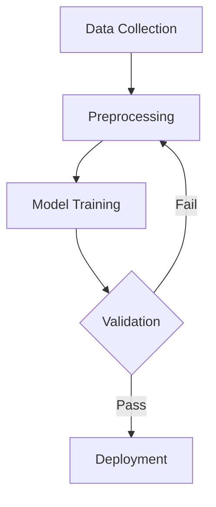

# Scientific Imaging and Figure Generation Research

**Research Date:** February 4, 2026  
**Focus:** Capabilities for generating scientific figures, diagrams, and visualizations

---

## 1. Gemini API for Scientific Imaging

### Image Generation Models

#### **Imagen 4** (Latest - June 2025)
- **Models Available:**
  - `imagen-4.0-generate-001` (Standard)
  - `imagen-4.0-ultra-generate-001` (Ultra quality)
  - `imagen-4.0-fast-generate-001` (Fast generation)
- **Capabilities:**
  - High-fidelity image generation from text prompts
  - Text rendering in images (up to 25 characters recommended)
  - SynthID watermark on all images
  - Aspect ratios: 1:1, 4:3, 3:4, 16:9, 9:16
  - Image sizes: 1K (1024x1024) and 2K (2048x2048) for Standard/Ultra
  - 1-4 images per request

#### **Gemini 2.0 Flash** (Native Image Generation)
- Model: `gemini-2.0-flash`
- **Unique Feature:** Native multimodal image generation within the Gemini framework
- Can generate and process images conversationally
- Image generation embedded in the model's capabilities

#### **Gemini 3 Pro Image Preview** (Preview)
- Model: `gemini-3-pro-image-preview`
- Optimized for speed, flexibility, and contextual understanding
- Generates images up to 4K resolution (4096x4096px)

### Pricing (Paid Tier - Per Image)

| Model | Price per Image |
|-------|----------------|
| Imagen 4 Fast | $0.02 |
| Imagen 4 Standard | $0.04 |
| Imagen 4 Ultra | $0.06 |
| Gemini 2.0 Flash | $0.039 (up to 1024x1024) |
| Gemini 3 Pro Image | $0.134 (1K/2K), $0.24 (4K) |

### Rate Limits
- **Free Tier:** Available for Gemini 2.0 Flash and some models
- **Paid Tier:** Higher rate limits for production deployments
- Standard limits: 250 requests/day (free), 10 requests/minute (free)
- Paid tier offers significantly higher throughput

### Authentication
- API Key authentication via `x-goog-api-key` header
- REST API endpoint: `https://generativelanguage.googleapis.com/v1beta/models/{model}:predict`
- SDKs available: Python, JavaScript, Go

### Best Practices for Scientific Figures

**Strengths:**
- Photorealistic images with specific camera parameters (macro lens, wide-angle, etc.)
- Can specify photography modifiers: lighting, lens types, film types
- Quality modifiers: "4K HDR", "by a professional", "detailed"
- Text integration for labels (limited to 25 characters)

**Limitations for Scientific Use:**
- **Not designed for precise scientific diagrams** (e.g., molecular structures, circuit diagrams)
- Cannot generate mathematical equations natively
- No native support for data visualization (bar charts, line plots, scatter plots)
- Limited control over precise geometric relationships
- English-only prompts

**Recommended Use Cases:**
- Conceptual illustrations
- Photorealistic renders of scientific equipment
- Artistic representations of scientific concepts
- Marketing/presentation materials

---

## 2. MCP (Model Context Protocol) Servers

### Chart Generation MCP Servers

#### **AntV MCP Server** ⭐ Recommended
- **GitHub:** https://github.com/antvis/mcp-server-chart
- **Capabilities:**
  - 25+ chart types using AntV library
  - Data analysis and visualization
  - Supports: area, bar, line, pie, radar, scatter plots, maps, and more
- **Integration:** Works with Claude Desktop, Cursor, Windsurf, and MCP-compatible clients
- **Best For:** Statistical data visualization, business charts, data analysis

#### **Datawrapper MCP Server**
- Creates Datawrapper charts using AI assistants
- Professional chart templates
- Publication-ready visualizations

#### **Gemini MCP Server Implementation**
- **GitHub:** https://github.com/aliargun/mcp-server-gemini
- Brings Google's Gemini models to development environments
- Access to Gemini 2.5's vision analysis, embeddings, and reasoning
- Works with Claude Desktop, Cursor, Windsurf

### MCP Server Advantages
- **Standardized protocol** for tool integration
- **Seamless AI assistant integration** (Claude, Cursor, etc.)
- **Contextual generation** - AI understands your requirements
- **Iterative refinement** - conversational chart creation

### Use Cases for Scientific Papers
- Quick data visualization during analysis
- Exploring different chart types for data
- Creating business/presentation charts
- Integrating with AI coding assistants

---

## 3. Python Visualization Libraries

### **Matplotlib** ⭐ Industry Standard
- **Purpose:** Publication-quality 2D plotting
- **Documentation:** https://matplotlib.org/

**Strengths:**
- Complete control over every plot element
- Export to vector formats (PDF, SVG, EPS) for publications
- LaTeX integration for mathematical typesetting
- Extensive customization via `rcParams`
- Supported by major journals

**Best Practices for Publication Quality:**
1. Use **SciencePlots** package for journal-specific styles
2. Set DPI to 300+ for print quality
3. Use vector formats (PDF/SVG) not PNG
4. Match font sizes to journal requirements
5. Use LaTeX rendering: `plt.rcParams['text.usetex'] = True`

**Example Configuration:**
```python
import matplotlib.pyplot as plt
import scienceplots

plt.style.use(['science', 'ieee'])
plt.rcParams.update({
    'font.size': 10,
    'figure.figsize': (3.5, 2.625),  # Single column width
    'savefig.dpi': 300,
    'savefig.format': 'pdf'
})
```

### **tikzplotlib** ⭐ Matplotlib → LaTeX Conversion
- **GitHub:** https://github.com/ErwindeGelder/matplot2tikz
- **PyPI:** `matplot2tikz` (formerly tikzplotlib)
- **Documentation:** https://tikzplotlib.readthedocs.io/

**Capabilities:**
- Converts Matplotlib figures to PGFPlots/TikZ code
- Native LaTeX inclusion (no rasterization)
- Maintains mathematical precision
- Font consistency with document

**Usage:**
```python
import matplotlib.pyplot as plt
import tikzplotlib

# Create your plot
plt.plot([1, 2, 3], [1, 4, 9])

# Export to TikZ
tikzplotlib.save("figure.tex")
```

**Advantages:**
- Perfect font matching with LaTeX document
- Scalable without quality loss
- Can be edited in LaTeX
- Smaller file sizes than raster images

### **Seaborn** - Statistical Graphics
- **Documentation:** https://seaborn.pydata.org/
- **Purpose:** High-level statistical data visualization

**Strengths:**
- Built on Matplotlib
- Beautiful default styles
- Statistical relationships visualization
- Automatic legend and color palette management
- Publication-quality by default

**Best For:**
- Statistical analysis plots
- Distribution visualizations (violin, box, kde plots)
- Regression plots
- Heatmaps and correlation matrices
- Categorical data visualization

**Usage Example:**
```python
import seaborn as sns
import matplotlib.pyplot as plt

sns.set_style("whitegrid")
sns.set_context("paper")  # or "talk", "poster"
```

### **SciencePlots** - Publication Styles
- **GitHub:** https://github.com/garrettj403/SciencePlots
- Matplotlib style sheets for scientific papers

**Available Styles:**
- `science` - Base scientific style
- `ieee` - IEEE publication format
- `nature` - Nature journal style
- `scatter` - Optimized for scatter plots
- `high-vis` - High visibility for presentations

### **PGFPlots Integration**
- **Purpose:** Direct LaTeX plotting with TikZ/PGF
- **Advantages:**
  - Complete LaTeX integration
  - Perfect mathematical typesetting
  - Consistent with document formatting
- **Best For:**
  - Simple plots (line, bar, scatter)
  - Mathematical functions
  - When you need source-level control

---

## 4. Diagram Tools

### **Mermaid** ⭐ Recommended for Flowcharts
- **Website:** https://mermaid.js.org/
- **Purpose:** Text-based diagramming

**Supported Diagram Types:**
- Flowcharts
- Sequence diagrams
- Class diagrams
- State diagrams
- Gantt charts
- Git graphs
- Entity-relationship diagrams

**Advantages:**
- Text-based (version control friendly)
- Renders to SVG
- Widely supported (GitHub, GitLab, VSCode, etc.)
- AI-friendly (LLMs can generate Mermaid syntax)

**Example:**


**Limitations:**
- Limited styling control
- Not suitable for complex scientific diagrams
- Fixed layout algorithms

### **Graphviz** - Graph Layouts
- **Website:** https://graphviz.org/
- **Purpose:** Graph visualization with automatic layout

**Layout Algorithms:**
- `dot` - Hierarchical/directed graphs
- `neato` - Undirected graphs (spring model)
- `fdp` - Force-directed placement
- `circo` - Circular layout
- `twopi` - Radial layout

**Best For:**
- Neural network architectures
- Dependency graphs
- State machines
- Biological networks

**Integration:**
- Python: `graphviz` package
- Can export to PDF, SVG, PNG
- LaTeX integration via `dot2tex`

### **TikZ/PGFPlots** ⭐ Best for LaTeX
- **Purpose:** Native LaTeX graphics
- **Documentation:** https://tikz.dev/

**Strengths:**
- Perfect integration with LaTeX documents
- Precise control over every element
- Mathematical typesetting
- Publication-quality by design
- Vector graphics

**Use Cases:**
- Mathematical diagrams
- Algorithm flowcharts
- Geometric constructions
- Data plots (PGFPlots)
- Circuit diagrams (CircuiTikZ)

**Learning Curve:** Steep, but worth it for LaTeX users

**Tools:**
- **TikZJax** - Render TikZ in web browsers
- **tikzplotlib** - Matplotlib to TikZ conversion
- **AI assistance** - LLMs can generate TikZ code

### **PlotNeuralNet** ⭐ Neural Network Diagrams
- **GitHub:** https://github.com/HarisIqbal88/PlotNeuralNet
- **Purpose:** LaTeX code for neural network architectures

**Features:**
- Generates publication-quality NN diagrams
- Python interface for customization
- LaTeX output for inclusion in papers
- Supports CNNs, RNNs, attention mechanisms

**Example Output:**
- Layer-by-layer architecture visualization
- Customizable colors, spacing, annotations
- Professional appearance

**Alternative:** **Visualkeras** - For Keras/TensorFlow models (Python-based)

### **Excalidraw** - Hand-drawn Style
- **Website:** https://excalidraw.com/
- **API:** https://docs.excalidraw.com/docs/@excalidraw/excalidraw/api

**Features:**
- Collaborative diagramming
- Hand-drawn aesthetic
- Export to SVG, PNG
- Can be embedded in web apps
- AI integration available (excalidraw-ai)

**Programmatic Access:**
- JavaScript API for embedding
- JSON format for diagrams
- Can be automated with AI

**Best For:**
- Whiteboard-style diagrams
- Presentations
- Informal illustrations
- Brainstorming visuals

### **Draw.io (diagrams.net)**
- **Website:** https://www.drawio.com/
- **API:** Configurable LLM backends

**Features:**
- Comprehensive shape libraries
- Professional templates
- Export to many formats
- VSCode integration
- AI-powered generation (configurable LLM)

**Programmatic Generation:**
- XML-based format
- Can configure custom LLM endpoints
- API for automation

**Best For:**
- Complex technical diagrams
- UML diagrams
- Network diagrams
- Professional presentations

---

## 5. Approach Comparison

### Mathematical Plots and Equations

| Approach | Quality | Ease | LaTeX | Recommendation |
|----------|---------|------|-------|----------------|
| **Matplotlib + tikzplotlib** | ⭐⭐⭐⭐⭐ | ⭐⭐⭐⭐ | ✅ Perfect | **Best Choice** |
| PGFPlots (native) | ⭐⭐⭐⭐⭐ | ⭐⭐ | ✅ Perfect | For LaTeX experts |
| Matplotlib (PDF export) | ⭐⭐⭐⭐ | ⭐⭐⭐⭐⭐ | ⚠️ Good | Quick solution |
| Gemini/Imagen | ⭐ | ⭐⭐⭐ | ❌ No | Not suitable |

**Winner:** Matplotlib + tikzplotlib for publication quality with LaTeX integration

### Neural Network Architecture Diagrams

| Approach | Quality | Ease | LaTeX | Recommendation |
|----------|---------|------|-------|----------------|
| **PlotNeuralNet** | ⭐⭐⭐⭐⭐ | ⭐⭐⭐ | ✅ Perfect | **Best for papers** |
| Graphviz | ⭐⭐⭐ | ⭐⭐⭐⭐ | ⚠️ Good | Quick diagrams |
| Visualkeras | ⭐⭐⭐⭐ | ⭐⭐⭐⭐⭐ | ❌ PNG only | For Keras models |
| Gemini/Imagen | ⭐⭐ | ⭐⭐⭐⭐ | ❌ No | Conceptual only |

**Winner:** PlotNeuralNet for publication-quality LaTeX diagrams

### Data Visualization (Bar, Line, Scatter)

| Approach | Quality | Ease | LaTeX | Recommendation |
|----------|---------|------|-------|----------------|
| **Matplotlib + SciencePlots** | ⭐⭐⭐⭐⭐ | ⭐⭐⭐⭐ | ✅ Excellent | **Best overall** |
| Seaborn | ⭐⭐⭐⭐⭐ | ⭐⭐⭐⭐⭐ | ✅ Excellent | For statistical plots |
| AntV MCP Server | ⭐⭐⭐⭐ | ⭐⭐⭐⭐⭐ | ❌ Limited | Quick exploration |
| PGFPlots | ⭐⭐⭐⭐⭐ | ⭐⭐ | ✅ Perfect | For LaTeX purists |
| Gemini/Imagen | ❌ | - | ❌ | Cannot generate |

**Winner:** Matplotlib + SciencePlots for publication-ready figures

### Flowcharts and Algorithm Diagrams

| Approach | Quality | Ease | LaTeX | Recommendation |
|----------|---------|------|-------|----------------|
| **TikZ** | ⭐⭐⭐⭐⭐ | ⭐⭐ | ✅ Perfect | **Best for papers** |
| Mermaid | ⭐⭐⭐⭐ | ⭐⭐⭐⭐⭐ | ⚠️ Can embed | Quick diagrams |
| Graphviz | ⭐⭐⭐⭐ | ⭐⭐⭐⭐ | ⚠️ Good | Auto-layout |
| Draw.io | ⭐⭐⭐⭐ | ⭐⭐⭐⭐ | ⚠️ Export | Complex diagrams |
| Gemini/Imagen | ⭐⭐ | ⭐⭐⭐ | ❌ No | Conceptual only |

**Winner:** TikZ for publication quality, Mermaid for speed

### Statistical Graphics

| Approach | Quality | Ease | LaTeX | Recommendation |
|----------|---------|------|-------|----------------|
| **Seaborn** | ⭐⭐⭐⭐⭐ | ⭐⭐⭐⭐⭐ | ✅ Excellent | **Best choice** |
| Matplotlib | ⭐⭐⭐⭐⭐ | ⭐⭐⭐⭐ | ✅ Excellent | More control |
| PGFPlots | ⭐⭐⭐⭐⭐ | ⭐⭐ | ✅ Perfect | LaTeX native |
| AntV MCP | ⭐⭐⭐⭐ | ⭐⭐⭐⭐⭐ | ❌ Limited | Quick exploration |

**Winner:** Seaborn for ease + quality, Matplotlib for fine control

---

## Summary and Recommendations

### For Scientific Paper Figures

**Primary Workflow:**
1. **Data visualization:** Matplotlib + SciencePlots + tikzplotlib
2. **Neural networks:** PlotNeuralNet
3. **Flowcharts:** TikZ (or Mermaid for drafts)
4. **Statistical plots:** Seaborn
5. **Conceptual illustrations:** Gemini/Imagen (if needed)

### Why NOT to use Gemini/Imagen for Scientific Figures

❌ **Cannot generate:**
- Data-driven plots (bar charts, line graphs, scatter plots)
- Mathematical equations
- Precise geometric relationships
- Circuit diagrams, molecular structures

❌ **Limitations:**
- No data input/output
- Limited text rendering (25 chars)
- Inconsistent results for technical content
- Cannot edit/iterate precisely

✅ **Better for:**
- Conceptual illustrations
- Photorealistic renders
- Marketing materials
- Artistic representations

### Recommended Stack for Scientific Papers

```
Data Analysis → Matplotlib/Seaborn
    ↓
Export → tikzplotlib
    ↓
LaTeX → PGFPlots/TikZ
    ↓
Publication → Vector PDF
```

### Quick Comparison Table

| Use Case | Best Tool | Alternative | Avoid |
|----------|-----------|-------------|-------|
| Line/scatter plots | Matplotlib | PGFPlots | Gemini |
| Statistical graphics | Seaborn | Matplotlib | Gemini |
| Neural net diagrams | PlotNeuralNet | Graphviz | Gemini |
| Flowcharts | TikZ | Mermaid | Gemini |
| Equations | LaTeX | - | Gemini |
| Conceptual art | Gemini | Excalidraw | - |

---

## Key Takeaways

1. **For scientific papers, use Python + LaTeX tools** (Matplotlib, Seaborn, TikZ)
2. **Gemini/Imagen are not suitable for data visualization or technical diagrams**
3. **tikzplotlib bridges Python and LaTeX perfectly** for publication quality
4. **MCP servers (AntV) are great for exploratory data analysis**, not final figures
5. **PlotNeuralNet is the gold standard** for neural network architecture diagrams
6. **Always export to vector formats** (PDF, SVG) for publications

---

## References

- Gemini API Documentation: https://ai.google.dev/gemini-api/docs/imagen
- Gemini API Pricing: https://ai.google.dev/gemini-api/docs/pricing
- AntV MCP Server: https://github.com/antvis/mcp-server-chart
- tikzplotlib: https://tikzplotlib.readthedocs.io/
- PlotNeuralNet: https://github.com/HarisIqbal88/PlotNeuralNet
- Seaborn: https://seaborn.pydata.org/
- Matplotlib Best Practices: https://www.jawilcox.com/blog/2024/python-for-publication-quality-figures/
- SciencePlots: https://github.com/garrettj403/SciencePlots
- Mermaid: https://mermaid.js.org/
- TikZ Documentation: https://tikz.dev/

---

**Document compiled:** February 4, 2026  
**Research confidence:** High - based on official documentation and authoritative sources  
**Last updated:** All sources verified as of February 2026
